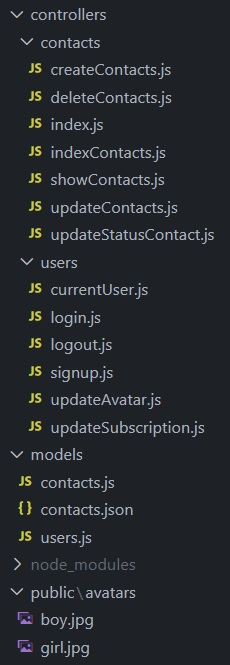
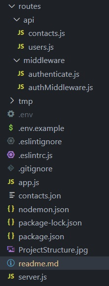

## REST API

---

REST API for working with a set of contacts.

## Introduction

---

Postman was used to work with the REST API.
Created a connection to MongoDB using Mongoose.

REST API supports the following routes:

- @GET /api/contacts
- @GET /api/contacts/:id
- @POST /api/contacts
- @DELETE /api/contacts/:id
- @PUT /api/contacts/:id
- @PATCH /api/contacts/:contactId/favorite
- @GET /api/contacts?page=1&limit=20 for pagination.
- @GET /api/contacts?favorite=true for filtering by favorite contacts.
- @PATCH /api/users/update-subscription to update the user's subscription.
- @PATCH /api/users/avatars

For routes that accept data (POST and PUT), checking (validation) of the received data has been considered. The joi package was used for validation.

Strategy used: Single Action Controller.

## Technologies

---

- Java Script
- Node.js

## Starting up

---

### First install all required dependencies:

- npm install

### To run the application, use the following command:

- npm start

### The application will run on localhost:3000.

## Project Structure

---

## Author

---

- Karolina Kaczorowska
- e-mail: kaczorowska.karolina@gmail.com
- GitHub: https://github.com/KaczorowskaKarolina
- LinkedIn: https://www.linkedin.com/in/karolina-kaczorowska-33b337220/
